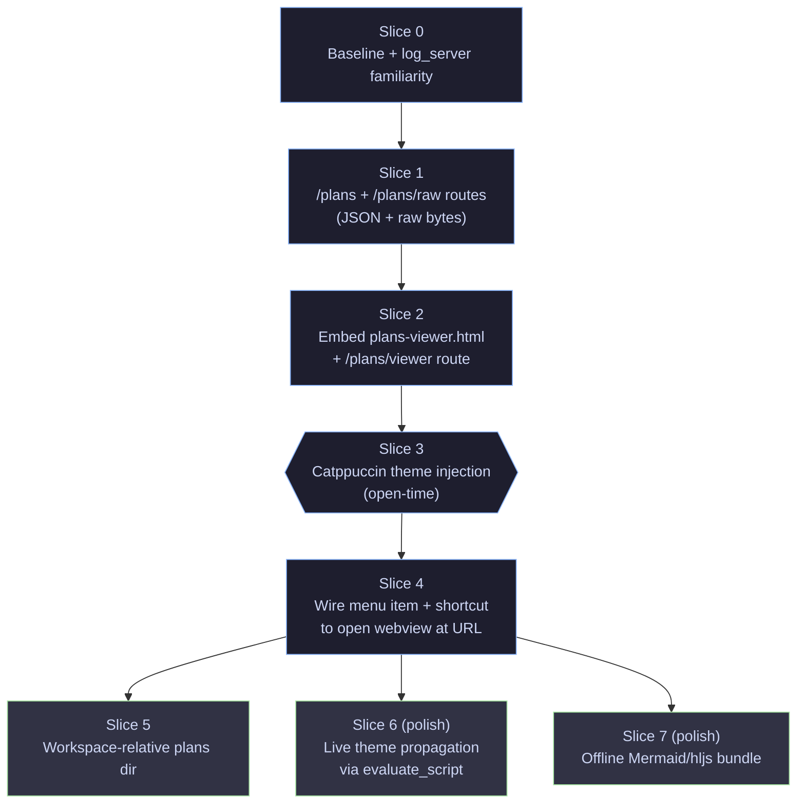

# Plans Viewer Integration

## Purpose

Bring the `.md`-source / HTML-visualization plan viewer pattern (originally
piloted in `cree8-portal-poc/.plans/viewer.html`) into gitterm-v2 as a
first-class feature, reusing the warp server and wry WebView that already exist
in the app.

The viewer should:

- Read `.md` files from a plans directory and render them with collapsible
  sections, a sticky TOC, syntax-highlighted code, and Mermaid diagram support.
- Be served from gitterm-v2's existing localhost server so there is no
  separate-server step or CORS problem.
- Render inside the existing wry WebView so it's an in-app surface, not an
  external browser tab.
- Follow the app's Catppuccin theme (Mocha dark / Latte light) so it blends
  with the rest of the UI.
- Preserve the **`.md` is the source of truth** invariant: the HTML viewer
  reads and renders, never edits or stores content.

## Why This Fits gitterm-v2

All the building blocks are already in place:

| Need                          | Already exists                                    |
| ----------------------------- | ------------------------------------------------- |
| Localhost HTTP server         | `src/log_server.rs` (warp, dynamic port)          |
| In-app HTML rendering surface | `src/webview.rs` (wry, used for markdown today)   |
| Theme system                  | `src/markdown.rs::ThemeColors` (Catppuccin)       |
| Markdown parsing in Rust      | `pulldown-cmark` already in `Cargo.toml`          |
| Feature-flag pattern          | `excalidraw` flag is precedent for opt-in surfaces |

This is integration work, not a new system.

## Data Flow

```mermaid
flowchart LR
    MD[".plans/*.md<br/>(source of truth)"]
    WARP["warp server<br/>(src/log_server.rs)"]
    HTML["plans-viewer.html<br/>(include_str! asset)"]
    WV["wry WebView<br/>(src/webview.rs)"]
    USER[("user in<br/>gitterm-v2")]

    MD -->|GET /plans/{file}.md| WARP
    WARP -->|GET /plans/viewer.html| WV
    WARP -->|raw markdown text| WV
    HTML -.embedded.-> WARP
    WV -->|renders| USER
    USER -->|opens via menu/shortcut| WV

    classDef source fill:#1e1e2e,stroke:#89b4fa,color:#cdd6f4
    classDef server fill:#313244,stroke:#a6e3a1,color:#cdd6f4
    classDef view fill:#11111b,stroke:#f9e2af,color:#cdd6f4
    class MD source
    class WARP,HTML server
    class WV,USER view
```

## Hard Constraints

- Do not break existing `/`, `/tab/{id}`, `/file/{id}` routes in
  `log_server.rs`.
- Do not introduce a second HTTP server; reuse the existing one.
- Do not require internet access at runtime for the viewer to work for plain
  markdown. (Mermaid diagrams may require CDN — see Open Decisions.)
- Stay consistent with the single-file architecture: viewer-specific logic in
  one new module (`src/plans_viewer.rs`), HTML as one embedded asset.
- Match Catppuccin Mocha (dark) and Latte (light) palettes from
  `markdown.rs::ThemeColors`.
- Don't duplicate `pulldown-cmark` rendering — the client-side `marked` does
  the rendering inside the webview, server only serves raw bytes.

## File Layout

New files:

- `src/plans_viewer.rs` — warp filters for `/plans/*` routes, plans directory
  resolution, helper to launch the webview at the right URL.
- `assets/plans-viewer.html` — themed static viewer, embedded via
  `include_str!` (so the binary stays single-artifact).

Touched files:

- `src/log_server.rs` — compose the new filter into `routes` in
  `start_server`. No behavior change to existing routes.
- `src/main.rs` — wire a menu item or keyboard shortcut that opens the viewer
  in the wry WebView at the appropriate localhost URL.
- `Cargo.toml` — no new deps required (warp already serves static bytes;
  Mermaid/highlight.js/marked load over CDN inside the webview).

## Route Shapes

To be added to the existing warp server in `log_server.rs` (or composed via
`plans_viewer::routes(state)` returning a `BoxedFilter`):

```rust
// GET /plans                       -> JSON list of available plans
// GET /plans/viewer                -> serves embedded viewer.html
// GET /plans/raw/{name}.md         -> raw markdown file bytes
// GET /plans/assets/{name}         -> any future bundled assets (optional)
```

Route shapes use `/plans/raw/{name}.md` rather than `/plans/{name}.md` so the
HTML asset path (`/plans/viewer`) and the data path (`/plans/raw/...`) don't
collide on the warp matcher.

Path safety: reject any name containing `/`, `..`, or starting with `.` to
prevent directory traversal. Reject anything that doesn't end in `.md`.

## Plans Directory Resolution

Open decision (see below), but the recommended default:

1. If the active workspace has a path, look for `<workspace>/.plans/*.md`.
2. Fallback: `$PWD/.plans/*.md` (where gitterm was launched from).
3. Configurable per-workspace via `workspaces.json` (`plans_dir` field).

The plans directory should be resolved fresh on each `GET /plans` so adding a
new `.md` file picks up without restarting the server.

## Theme Mapping

`plans-viewer.html` already has CSS variables for theming. Map them to the
existing Catppuccin palette from `markdown.rs`:

| Viewer var       | Mocha (dark)        | Latte (light)       |
| ---------------- | ------------------- | ------------------- |
| `--bg`           | `#1e1e2e` (base)    | `#eff1f5` (base)    |
| `--panel`        | `#181825` (surface) | `#e6e9ef` (surface) |
| `--panel-2`      | `#313244` (overlay) | `#dce0e8` (overlay) |
| `--border`       | `#45475a`           | `#bcc0cc`           |
| `--text`         | `#cdd6f4`           | `#4c4f69`           |
| `--muted`        | `#6c7086`           | `#6c6f85`           |
| `--accent`       | `#89b4fa` (blue)    | `#1e66f5` (blue)    |
| `--accent-2`     | `#a6e3a1` (green)   | `#40a02b` (green)   |
| `--code-bg`      | `#11111b` (crust)   | `#dce0e8`           |

Two ways to propagate the active theme to the webview:

1. **At open time (simple)**: server reads current `AppTheme`, injects the
   right CSS variable set into the HTML template before serving. No live
   updates if user toggles theme; reopening picks it up.
2. **Live (nicer)**: viewer.html exposes `window.__setTheme('dark'|'light')`,
   gitterm-v2 calls `webview::evaluate_script(...)` when the user toggles
   the app theme.

Recommend (1) for the first slice; (2) as a polish follow-up.

## How the User Opens It

Three reasonable surfaces:

1. **Menu item**: `View → Plans Viewer` opens the wry webview at the viewer
   URL.
2. **Keyboard shortcut**: `Cmd+Shift+P` (avoiding the system-wide cmd+p).
3. **New tab type**: introduce a "Plans" tab that lives in the existing tab
   strip. Heavier change, but most discoverable.

Recommend starting with (1) + (2); promote to (3) if used heavily.

## Open Decisions

- **Plans directory source**: workspace-relative? `cwd`-relative? configurable
  per workspace? Default behavior matters because the first time someone tries
  it, "no plans found" needs to either be obvious-why or impossible.
- **Mermaid rendering**: CDN load (works today, requires internet) vs.
  bundled `mermaid.esm.min.mjs` in `assets/`. Bundling makes it offline-safe
  but adds ~800kb to the binary. Recommend CDN for slice 1, evaluate later.
- **Highlight.js**: same trade-off; same recommendation (CDN first).
- **Viewer surface**: webview overlay vs. dedicated tab. Tab is a bigger
  change, overlay is the existing pattern.
- **Edit affordance**: should clicking a heading or section open the `.md`
  in the user's editor? Tempting, but breaks the "viewer never edits"
  invariant and adds platform-specific shell-out. Defer.

## Slice Plan

Each slice should compile, run, and not regress existing behavior.



### Slice 0 — Baseline

Goal: confirm the warp server starts, the webview module is functional, and a
new module can be added without breaking the single-file `main.rs` pattern.

Steps:

1. Run `cargo run`, confirm log server URL appears in console.
2. Open `http://localhost:<port>/` in an external browser, confirm tabs list
   renders.
3. Read `log_server.rs::start_server` end-to-end. Note that all handlers are
   plain async functions that take `ServerState` and return `Result<impl
   warp::Reply, warp::Rejection>`. New routes follow that shape.

Acceptance: no code changes; familiarity recorded.

### Slice 1 — `/plans` and `/plans/raw/{name}.md` routes

Goal: serve plans data over warp.

Steps:

1. Create `src/plans_viewer.rs`. Add `mod plans_viewer;` to `main.rs`.
2. Implement `pub fn routes(state: ServerState) -> BoxedFilter<(impl Reply,)>`
   that returns the two routes. Reject path traversal and non-`.md` names.
3. Resolve the plans directory: for slice 1 hardcode `./.plans` relative to
   gitterm-v2's launch dir.
4. In `log_server::start_server`, compose: `let routes = index.or(tab).or(file).or(plans_viewer::routes(state.clone()));`

Acceptance: `curl http://localhost:<port>/plans` returns JSON like
`{"plans":[{"name":"agent-tab-integration.md","title":"Agent Tab Integration"}]}`.
`curl http://localhost:<port>/plans/raw/agent-tab-integration.md` returns the
raw file bytes.

### Slice 2 — Embed `plans-viewer.html`

Goal: serve the viewer HTML from a single embedded asset.

Steps:

1. Adapt `cree8-portal-poc/.plans/viewer.html` to:
   - Use CSS variables only (already does).
   - Hit `/plans` for the plan list (don't hardcode).
   - Hit `/plans/raw/{name}.md` for raw markdown.
2. Save as `assets/plans-viewer.html`.
3. In `plans_viewer.rs`, add `GET /plans/viewer` route:
   ```rust
   const VIEWER_HTML: &str = include_str!("../assets/plans-viewer.html");
   ```
   Serve as `text/html; charset=utf-8`.

Acceptance: opening `http://localhost:<port>/plans/viewer` in an external
browser renders the viewer with the gitterm-v2 plans listed and selectable.

### Slice 3 — Theme injection

Goal: viewer matches the app theme on open.

Steps:

1. Add `ThemeVars` struct in `plans_viewer.rs` mirroring the table in this doc.
2. Replace literal CSS values in `plans-viewer.html` with `{{TOKEN}}`
   placeholders.
3. On `GET /plans/viewer`, read the current `AppTheme` (will need to plumb
   through `ServerState` or a `theme: Arc<RwLock<AppTheme>>`), substitute, and
   serve.

Acceptance: launching gitterm-v2 in Mocha vs. Latte shows the corresponding
palette in the viewer.

### Slice 4 — Open in webview

Goal: the user opens the viewer from inside gitterm-v2.

Steps:

1. Add a menu item (via `muda`) under "View" → "Plans Viewer".
2. On selection, compute the URL: `format!("{}/plans/viewer",
   state.base_url().expect("server running"))`.
3. Call `webview::set_pending_content` (or whatever the equivalent navigate
   call is — verify; may need a new helper that takes a URL instead of HTML).
4. Add keyboard shortcut `Cmd+Shift+P`.

Acceptance: menu click opens the viewer inside the app's webview area.

### Slices 5–7

Defer until 1–4 are validated in real use. Capture pain points first.

## Verification

After each slice that touches `log_server.rs` or `webview.rs`:

- `cargo build` — no warnings introduced.
- Launch app, confirm:
  - Existing `/tab/{id}` and `/file/{id}` routes still work.
  - New `/plans/*` routes return the expected shape.
  - Webview can navigate to the viewer URL without errors.

## Risks And Mitigations

### Risk: webview navigation API may not accept URLs directly

`webview::set_pending_content` takes HTML, not a URL. May need to either:

- Add `webview::navigate_to_url(url: &str)` that calls into wry's load_url
  equivalent.
- Or serve the viewer HTML inline and have it boot itself via JS fetch (works
  but loses same-origin advantage).

Mitigation: verify wry's API during Slice 4 spike before committing to either.

### Risk: theme toggling mid-session feels jarring

If theme injection is open-time only (Slice 3), users toggling between Mocha
and Latte will see a stale viewer until reopen.

Mitigation: ship Slice 3 with a clear comment; address in Slice 6.

### Risk: directory traversal via crafted `/plans/raw/{name}.md`

A malicious or buggy client could request `../../etc/passwd`.

Mitigation: in `plans_viewer.rs`, reject names containing `/`, `\`, `..`, or
starting with `.`; require `.md` suffix; join via `Path::join` then verify the
resolved path's parent equals the canonical plans dir.

### Risk: offline use breaks Mermaid/syntax highlighting

CDN load fails without internet. Plain markdown still renders.

Mitigation: bundling deferred to Slice 7. Document the limitation.

## Definition Of Done For First Phase

- `View → Plans Viewer` menu item opens the in-app viewer.
- Viewer lists plans from `<workspace>/.plans/*.md` (or `./.plans` fallback).
- Selecting a plan renders with TOC, collapsible sections, Catppuccin theme,
  Mermaid diagrams, and syntax-highlighted code blocks.
- All pre-existing routes and webview behavior unchanged.
- No new runtime crates added.

## Reference

Origin pilot: `cree8-portal-poc/.plans/viewer.html` plus Mermaid blocks added
to `cree8-portal-poc/.plans/transfer-core-refactor-implementation-plan.md`.
The pattern's core invariant — `.md` is the source of truth, HTML is the
visualization — is preserved here exactly; only the transport (warp instead of
`python3 -m http.server`) and the rendering surface (wry webview instead of
external browser) change.
