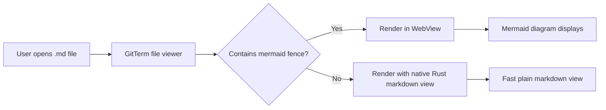
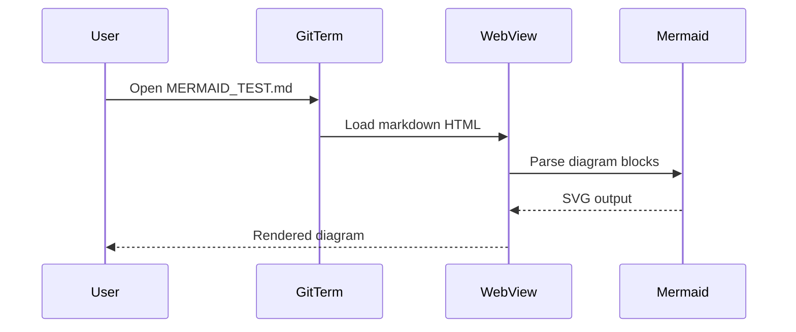

# Mermaid Smoke Test

This file is for validating Markdown + Mermaid rendering in GitTerm.

```mermaid
flowchart LR
    A["User opens .md file"] --> B["GitTerm file viewer"]
    B --> C{"Contains mermaid fence?"}
    C -- Yes --> D["Render in WebView"]
    C -- No --> E["Render with native Rust markdown view"]
    D --> F["Mermaid diagram displays"]
    E --> G["Fast plain markdown view"]
```

```mermaid
sequenceDiagram
    participant U as User
    participant G as GitTerm
    participant W as WebView
    participant M as Mermaid

    U->>G: Open MERMAID_TEST.md
    G->>W: Load markdown HTML
    W->>M: Parse diagram blocks
    M-->>W: SVG output
    W-->>U: Rendered diagram
```
