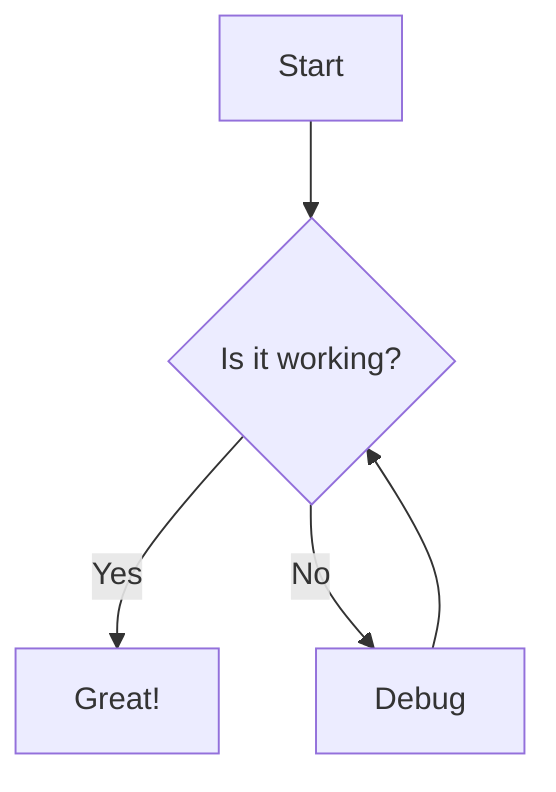

# Test Markdown File

This is a test file to verify the markdown preview functionality.

## Features

- Headers (H1-H6)
- **Bold** and *italic* text
- Code blocks
- Lists
- Blockquotes
- Mermaid diagrams

### Code Example

```rust
fn main() {
    println!("Hello, world!");
}
```

### Mermaid Diagram



### Task List

- [x] Implement markdown parsing
- [x] Add syntax highlighting
- [ ] Test mermaid rendering
- [ ] Polish UI

> This is a blockquote to test styling.

---

That's all for now!
